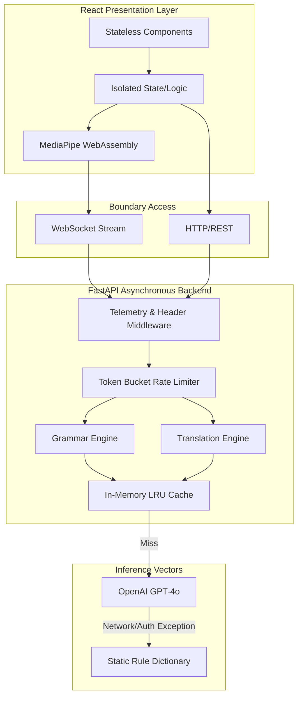
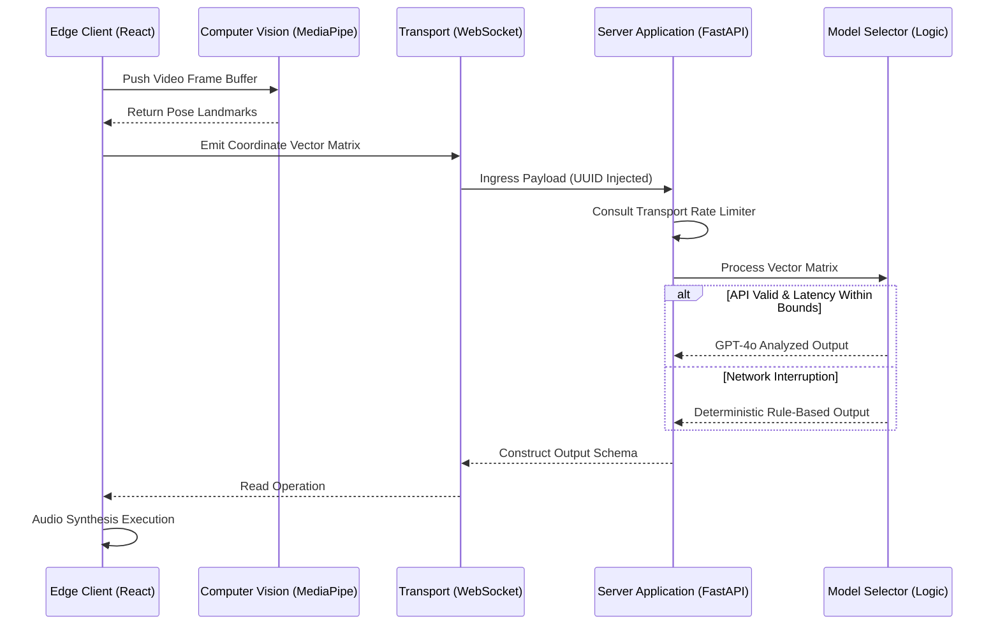
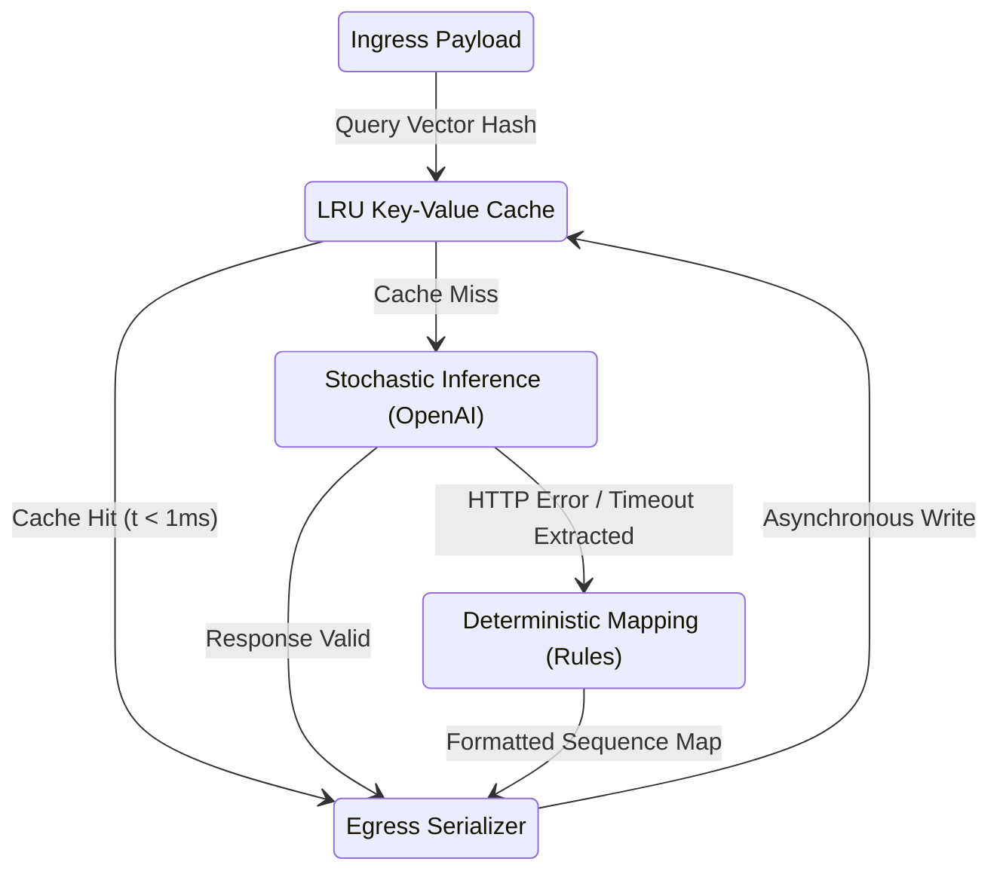

# SHIA (SignAI_OS) System Architecture

| Parameter | Specification |
| --- | --- |
| Application Profile | Bidirectional edge-translation interface. |
| Architecture Mode | Asynchronous, event-driven stream processing. |
| Core Objective | Sub-second latency translation utilizing decoupled logic layers. |

## Operational Matrices

| Mode | Ingress | Boundary Processing | Central Inference | Egress |
| --- | --- | --- | --- | --- |
| Sign-to-Speech | Local Camera | MediaPipe Edge-CV | Grammar Orchestrator | Native Web Audio TTS |
| Speech-to-Sign | Local Microphone | Web Speech API | Translation Orchestrator | React Canvas UI |

## Core System Architecture



## Sequential Execution: Sign-to-Speech Flow



## Inference Pipeline Determinism



## Infrastructure Matrix

| Layer | Environment | Technology | Responsibility Constraint |
| --- | --- | --- | --- |
| Client | Node 18+ | Next.js 16 | Segregated logic/presentation, zero data egress CV. |
| Server | Python 3.10+ | FastAPI | Asynchronous IO strict compliance, event loop management. |
| Processing | Native | MediaPipe | Offloaded spatial compute. |
| Storage | Memory | Dict-based Hash | TTL constraints, external dependency mitigation. |

## Deployment Operations

### Environment Configuration

| Variable | Fallback Default | Domain Specificity |
| --- | --- | --- |
| `ENV` | `development` | Operating context. |
| `FRONTEND_URL` | `http://localhost:3000` | Strict CORS configuration matrix. |
| `HOST` | `0.0.0.0` | Socket assignment vector. |
| `PORT` | `8000` | Application bind port. |
| `LOG_LEVEL` | `INFO` | STDOUT/STDERR threshold. |
| `OPENAI_API_KEY` | `null` | Requires defined credential for stochastic logic. |
| `OPENAI_MODEL` | `gpt-4o-mini` | Parameter allocation target. |
| `WS_RATE_LIMIT`| `20` | Volumetric constraints (messages/second). |

### Base Instantiation

```bash
git clone https://github.com/astr012/shia-app.git
cd shia-app

# Backend Routine
cd backend
python -m venv venv
source venv/bin/activate
pip install -r requirements.txt
cp .env.example .env
uvicorn app.main:app --host 0.0.0.0 --port 8000

# Frontend Routine
cd ../frontend
npm install
npm run dev

# Container Routine
cd ../
docker compose up --build
```

## Interface Protocols

### HTTP/REST Matrix

| Vector | End-node | Telemetry Profile | Execution Pattern |
| --- | --- | --- | --- |
| `GET` | `/health` | Diagnostic | Returns system boundary status. |
| `GET` | `/api/analytics` | APM | Returns cache hit ratios & latency distribution. |
| `GET` | `/api/sessions` | APM | Maps active WebSocket handlers. |
| `GET` | `/api/vocabulary`| Static | Exposes deterministic boundary constraints. |
| `POST`| `/api/translate` | Process | Initiates synchronous pipeline. |
| `DELETE`| `/api/cache` | Command | Purges LRU dictionaries. |

### Header Boundaries
- Obligatory `X-Request-ID` propagation across all HTTP routines.
- Obligatory `X-Response-Time` insertion by response middleware.

### WebSockets (`/ws`)
- Handshake confirmation required.
- Heartbeat ping scheduled at 30,000ms intervals.
- Throttled automatically at application memory boundary.

#### Schema (Client to Server)
```json
{ "type": "gesture_sequence", "payload": { "gestures": ["GESTURE_ID"] } }
```

#### Schema (Server to Client)
```json
{ "type": "translation_result", "payload": { "translated_text": "string", "cached": boolean } }
```

## Security & Observability Operations

| Defense Variable | Methodology | Framework Node |
| --- | --- | --- |
| Exhaustion Mitigation | Token Bucket algorithms | `rate_limiter.py` |
| Execution Tracing | Immutable UUID mapping | `middleware.py` |
| Payload Verification | Pydantic strict casting | Subsystem models |
| Leakage Prevention | Client-side memory CV processing | Browser WebAssembly |
| Dependency Isolation | Deterministic engine fallbacks | `grammar_engine.py` |
| Authorization | Role-based access control (user/admin) | `auth.py` → `require_role()` |
| CORS Hardening | Restricted methods + explicit header allowlist | `main.py` → `CORSMiddleware` |
| CSRF Protection | Origin/Referer validation on state-changing requests | `middleware.py` → `CSRFMiddleware` |
| XSS Prevention | Input sanitization + Content-Security-Policy | `translation.py` + `SecurityHeadersMiddleware` |
| SQL Injection Prevention | SQLAlchemy ORM parameterized queries (zero raw SQL) | `crud.py`, `database.py` |
| Password Policy | bcrypt hashing + configurable strength validation | `auth.py` → `validate_password_strength()` |
| Transport Security | HSTS + Permissions-Policy headers (production) | `SecurityHeadersMiddleware` |
| Quality Control | 86 deterministic passing tests | `pytest` suite |
