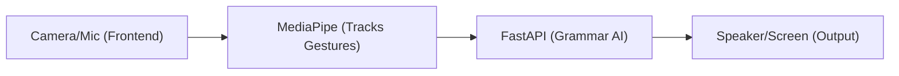
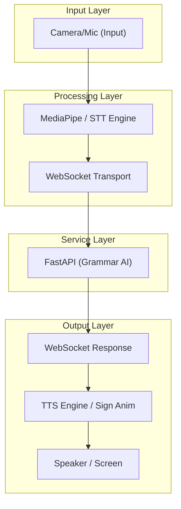
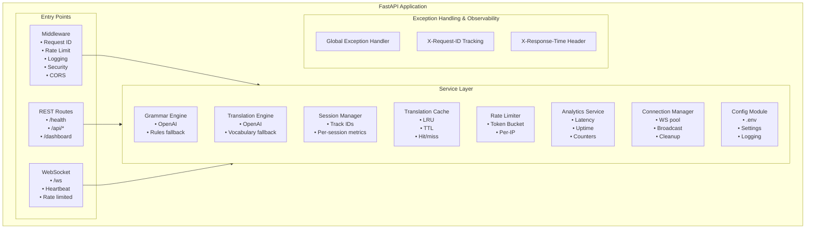
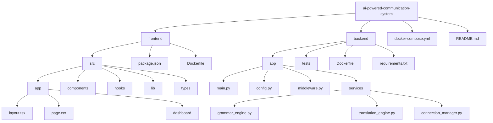

# SHIA (SignAI_OS) - Sign Language Human Interface AI

> Production-ready real-time translation system bridging sign language and spoken languages through edge AI and Large Language Models.

      

---

## Executive Summary

**SHIA** is a full-stack, enterprise-grade application engineered to provide zero-latency bidirectional translation between sign language and spoken language. The system leverages MediaPipe for client-side gesture tracking, GPT-4o for natural language processing and grammar restructuring, and continuous WebSocket streams for real-time data transport.

### Operational Modes

| Mode | Direction | Processing Pipeline |
|------|-----------|---------------------|
| **Sign to Speech** | Camera -> MediaPipe -> Gesture Detection -> Grammar AI -> TTS -> Speaker Output |
| **Speech to Sign** | Microphone -> STT -> Translation Engine -> Sign Sequence -> Screen Rendering |

---

## System Architecture



### Data Pipeline Flow



### Backend Service Architecture



---

## Technology Stack

### Frontend Application (Next.js)
- **Framework:** Next.js 16 (App Router) with TypeScript
- **Styling:** Tailwind CSS v4, Framer Motion for hardware-accelerated animations
- **Computer Vision:** MediaPipe Hands (client-side execution, ensuring zero data egress)
- **Audio Processing:** Web Speech API for native browser STT and TTS handling
- **Transport Layer:** WebSocket for persistent, bidirectional communication
- **Routing:** Core application (`/`) and administrative dashboard (`/dashboard`)

### Backend Infrastructure (FastAPI)
- **Framework:** Python FastAPI (fully asynchronous implementation)
- **Real-time Engine:** Native WebSocket handler with session tracking and heartbeat mechanisms
- **Grammar Translation Engine:** OpenAI GPT-4o integration, backed by an offline rule-based deterministic engine
- **Sign Sequence Generation:** LLM-enhanced decomposition backed by a longest-match tokenization vocabulary engine
- **Performance Optimization:** LRU translation cache with TTL parameters to mitigate external API dependency
- **Traffic Management:** Token bucket rate limiting applied per-session (WebSocket) and per-IP (REST)
- **Middleware Infrastructure:** Request ID propagation, standardized logging, security headers, and CORS management
- **Error Handling:** Standardized global exception interception returning structured JSON payloads
- **Test Infrastructure:** Comprehensive suite consisting of 75 tests spanning unit and integration boundaries (pytest, pytest-asyncio)

---

## Deployment & Setup Guide

### System Requirements
- Node.js environment (v18 or higher)
- Python environment (v3.10 or higher)
- npm package manager

### 1. Repository Initialization

```bash
git clone https://github.com/astr012/shia-app.git
cd shia-app
```

### 2. Backend Environment Setup

```bash
cd backend
python -m venv venv
venv\Scripts\activate       # Windows environments
# source venv/bin/activate  # Unix-like environments

pip install -r requirements.txt
cp .env.example .env        # API credentials configuration required

uvicorn app.main:app --reload --host 0.0.0.0 --port 8000
```

System access points: 
- Base API: `http://localhost:8000`
- Swagger Documentation: `http://localhost:8000/docs`
- ReDoc Documentation: `http://localhost:8000/redoc`

### 3. Frontend Environment Setup

```bash
cd frontend
npm install
npm run dev
```

Application interface accessible at `http://localhost:3000`.

### 4. Containerized Deployment (Docker)

For reproducible production environments, utilize Docker Compose:

```bash
docker compose up --build
```

### 5. Automated Test Suite

A comprehensive test suite of 75 deterministic tests covers REST endpoints, the WebSocket pipeline, middleware layers, and core services.

```bash
cd backend
.\venv\Scripts\activate
python -m pytest tests/ -v
```

### 6. Configuration Parameters

The backend requires a configured `.env` file based on `.env.example`. 

| Parameter | Requirement | Default | Description |
|-----------|-------------|---------|-------------|
| `ENV` | Optional | `development` | Defines the execution environment. |
| `HOST` | Optional | `0.0.0.0` | Server interface binding. |
| `PORT` | Optional | `8000` | Port allocation for the HTTP server. |
| `LOG_LEVEL` | Optional | `INFO` | Standard logging verbosity threshold. |
| `OPENAI_API_KEY` | Optional | — | Required for LLM-powered context mapping. System falls back to rule-based execution if omitted. |
| `OPENAI_MODEL` | Optional | `gpt-4o-mini` | Specifies the OpenAI model architecture for translation calls. |
| `FRONTEND_URL` | Optional | `http://localhost:3000` | Origin URL for CORS configurations. |
| `WS_RATE_LIMIT` | Optional | `20` | Threshold limit for WebSocket incoming messages per second. |

---

## Codebase Architecture



---

## API Documentation

### RESTful Interface

| Method | Endpoint | Domain | Purpose |
|--------|----------|--------|---------|
| `GET` | `/health` | Core | System diagnostics, uptime reporting, and service health indicators. |
| `POST` | `/api/translate` | Processing | Synchronous translation endpoint for text processing. |
| `GET` | `/api/analytics` | Telemetry | System-wide statistics including latency metrics, cache hit rates, throughput. |
| `GET` | `/api/vocabulary` | Core | Retrieves the complete application mapping vocabulary payload. |
| `GET` | `/api/grammar-rules` | Core | Retrieves deterministic grammar mappings utilized in offline fallback. |
| `GET` | `/api/sessions` | Telemetry | Connection diagnostic data for all active WebSocket sessions. |
| `GET` | `/api/cache` | Telemetry | Exposes internal cache state and performance ratios. |
| `DELETE` | `/api/cache` | Administration | Forcibly invalidates all cached translation contexts. |

*Detailed OpenAPI specifications are programmatically generated and available at `/docs`.*

### HTTP Contract Specifications

Standardized headers across all responses ensure traceability and security:
- `X-Request-ID`: UUID assigned at ingress request boundary.
- `X-Response-Time`: End-to-end execution duration boundary trace.
- Standard Headers: `X-Content-Type-Options`, `X-Frame-Options`, `X-XSS-Protection`.

### WebSocket Communication Protocol (`/ws`)

The real-time streaming architecture operates via persistent stateful WebSocket connections:

**Connection Lifecycle:**
1. Handshake execution on `ws://domain/ws`.
2. Initial state transfer via `session_info` payload encapsulating session ID UUID allocation.
3. Server-initiated heartbeat ping mechanism (default 30-second interval).
4. Full-duplex messaging interface subject to token-bucket rate limiting (20 msg/sec configurable).

**Client Message Schemas:**
```json
{ "type": "gesture_sequence", "payload": { "gestures": ["HELLO", "HOW_ARE_YOU"] } }
{ "type": "speech_input", "payload": { "text": "Hello, how are you?" } }
{ "type": "manual_text", "payload": { "text": "Testing string", "mode": "SIGN_TO_SPEECH" } }
```

**Server Return Schemas:**
```json
{ "type": "translation_result", "payload": { "translated_text": "Hello! How are you?", "processing_time_ms": 1.5, "cached": false } }
{ "type": "sign_animation", "payload": { "sign_sequence": ["WAVE_HELLO", "HOW", "BE", "POINT_FORWARD"] } }
{ "type": "heartbeat", "payload": { "timestamp": "ISO8601", "session_id": "UUID" } }
```

---

## Internal Service Documentation

### Grammar Resolution Engine
The `GrammarEngine` class abstracts the transformation of raw gesture tokens into structurally coherent spoken languages.
- Implements dependency injection for model switching. Calls OpenAI's API when configured.
- Fails over to a deterministic mapping engine comprising over 30 fundamental ASL-to-English semantic rules, ensuring system operability in offline or restricted environments.

### Translation Matrix Engine
The `TranslationEngine` handles processing spoken language directly to component gesture concepts.
- Decomposes English sentences to ASL gesture equivalents.
- Primary method relies on context-aware language models.
- The failover mechanism utilizes a longest-token-match algorithm against an extensive predefined dictionary, mitigating API latency during high traversal limits.

### Cache Subsystem
A robust LRU (Least Recently Used) translation cache mitigates redundant LLM compute cycles.
- Features isolated namespaces for grammar corrections versus sequence translation.
- Provides comprehensive telemetry including operational hit-rate efficiency.

### Rate Limiting Subsystem
Implements token bucket methodologies to maintain system stability under load spikes or abuse vectors.
- Isolates WebSocket clients to a default of 20 msg/sec.
- Applies standard 30 req/sec throttles to REST APIs per originating IP, exempting health endpoints for diagnostic monitoring.

### Telemetry and Analytics Engine
Tracks operational parameters across the deployed stack running entirely in-memory for minimal I/O overhead.
- Includes granular tracking of processing latency decomposed by engine (grammar vs translation vs transit).
- Provides queryable endpoints mapping load statistics to scaling operations.

---

## Operational Intelligence

The platform features an integrated administrative dashboard reachable at `/dashboard`.

Capabilities Include:
- Real-time visualization of component states and process latency.
- WebSocket persistent connection monitoring.
- Active read-outs of the token-bucket systems and cache retention levels.

---

## Engineering Precepts

The SHIA architecture relies strictly on these engineering foundations:

- **Data Privacy Assurance:** By offloading vision processing to the edge (in-browser WASM compilation via MediaPipe), identifiable video streams are never transmitted, significantly reducing risk envelopes.
- **Fail-Safe Processing Strategies:** The architecture avoids rigid external dependencies. Missing API keys or network degradation silently degrade system operation to localized, deterministic processing parameters, preserving system uptime.
- **Performance by Design:** Eliminating synchronous database latency constraints and prioritizing in-memory caching ensures micro-second latency levels required for human communication synchronization.
- **Security-First Interfaces:** Endpoints employ automatic parameter validation via Pydantic schema verification alongside systemic cross-site boundary restrictions.
- **Observability Driven:** Request tracing ensures full life cycle visibility.

---

## Security Implementation

| Subsystem Focus | Implementation Methodology | Integration Point |
|-----------------|----------------------------|-------------------|
| Volume Control | Token bucket algorithms throttling endpoints and streams | `middleware.py`, `rate_limiter.py` |
| Route Integrity | Robust CORS allowance lists supporting credentials | `main.py` (CORSMiddleware) |
| Output Encoding | Default React encoding pipelines mitigating injection points | React Components |
| Parameter Verification | Strict type coercion and boundary constraints via Pydantic | `main.py` Models |
| Audit Tracing | UUID propagation injected into system logs for forensic tracing | `middleware.py` |
| Exception Boundary | Standardized handler neutralizing internal stack trace exposure | `main.py` |

---

## Licensing Terms

Software provided under the parameters of the MIT License. See `LICENSE` for exact specifications and warranty disclaimers.

---

<p align="center">
  <strong>SHIA (SignAI_OS)</strong><br/>
  <em>Advanced Computational Translation Architecture</em>
</p>
